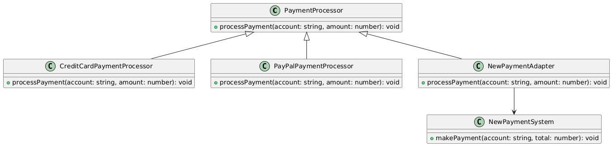

# Integración de un Sistema de Pago Externo V1.0.0

## Author: **Edgar Guerrero**

Este repo usa **typescript": "^5.8.2".

## Arquitectura en Capas

La implementación sigue una arquitectura en capas básica con las siguientes capas:

1. **Capa de Aplicación (Application Layer):** Contiene la lógica de negocio y orquesta el procesamiento de pagos (`PaymentService.ts`).
2. **Capa de Dominio (Domain Layer):** Define las interfaces y clases de dominio (`PaymentProcessor.ts` y las clases de implementación).
3. **Capa de Infraestructura (Infrastructure Layer):** Contiene la implementación concreta de las interfaces de dominio y adapta sistemas externos (`NewPaymentAdapter.ts`, `CreditCardPaymentProcessor.ts`, `PayPalPaymentProcessor.ts`, `NewPaymentSystem.ts`).

## Patrón Usado y Justificación

Para integrar un nuevo sistema de pago sin alterar la lógica existente, se ha utilizado el **Patrón de Adaptador (Adapter Pattern)**. Este patrón permite que las interfaces incompatibles trabajen juntas, convirtiendo la interfaz de una clase en otra que el cliente espera. De esta manera, se puede integrar el nuevo sistema de pago sin modificar la lógica interna del sistema de comercio electrónico existente.

### Justificación:
- **Compatibilidad:** Permite que el nuevo sistema de pago se integre sin cambiar la estructura del sistema existente.
- **Flexibilidad:** Facilita la adición de nuevos métodos de pago en el futuro con mínimas modificaciones.
- **Mantenibilidad:** Mantiene el código limpio y separado, respetando la arquitectura en capas.

## Diagrama de Clases


## Cómo Ejecutar

1. Clona el repositorio.
2. Instala las dependencias en la carpeta raíz:
    ```sh
    cd ./src
    npm install
    ```
3. Ingresa a la carpeta del ejercicio
    ```sh
    cd exercise_3
    ```
4. Ejecuta el código:
    ```sh
    npx ts-node main.ts
    ```